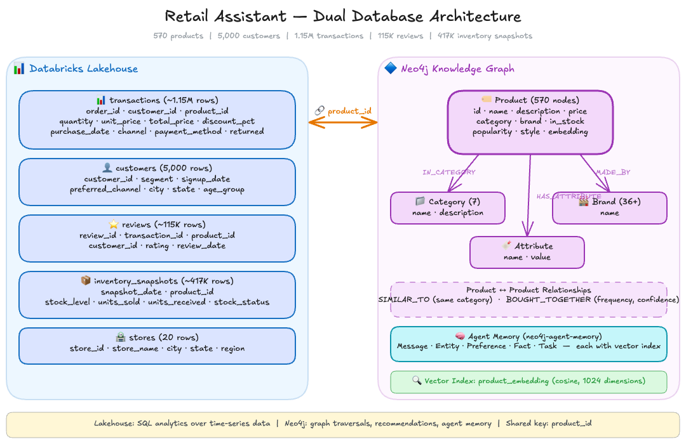
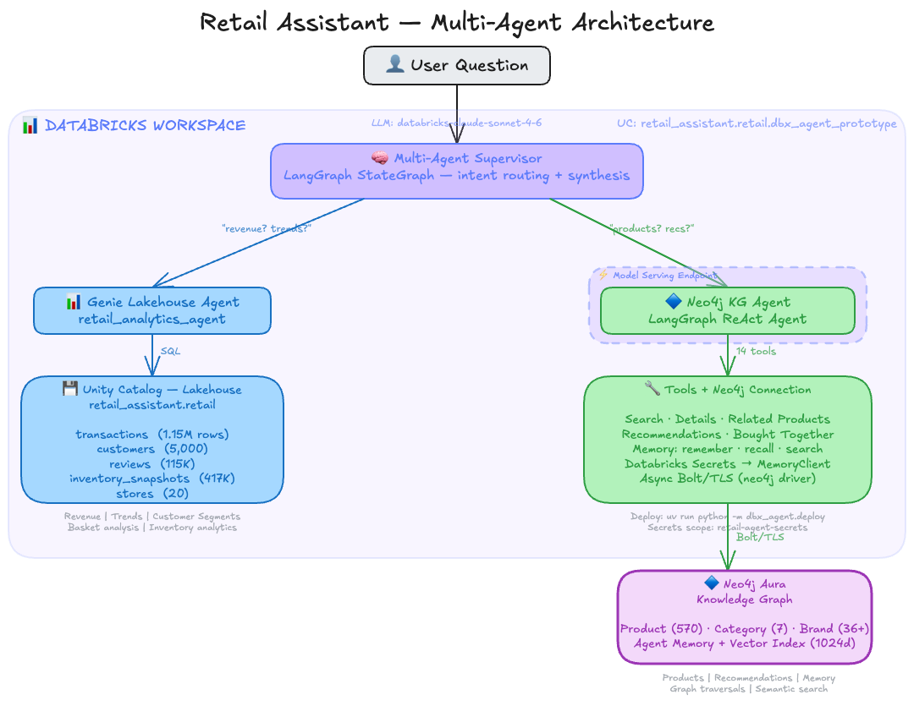

# Databricks Retail Assistant

A two-agent supervisor system deployed on Databricks using Genie, AgentBricks, and the Mosaic AI Agent Framework. A supervisor classifies user intent and routes analytics questions to a Genie Lakehouse Agent and product/recommendation questions to a Neo4j Knowledge Graph Agent. The KG agent is a LangGraph ReAct agent with persistent memory, deployed to Databricks Model Serving via MLflow.

## Architecture Overview

### Data Architecture

The assistant draws from two complementary data stores connected by a shared `product_id` key:



- **Databricks Lakehouse.** 5 Delta tables in Unity Catalog (`retail_assistant.retail`) holding 1.15M transactions, 5,000 customers, 115K reviews, 417K daily inventory snapshots, and 20 stores. Optimized for SQL analytics, including revenue trends, customer segments, and basket analysis.
- **Neo4j Knowledge Graph.** 570 products with Category, Brand, and Attribute nodes connected by relationships (IN_CATEGORY, MADE_BY, SIMILAR_TO, BOUGHT_TOGETHER, HAS_ATTRIBUTE). Includes agent memory (Message, Entity, Preference, Fact, Task) and a vector index for semantic search.

### Multi-Agent Architecture

A two-agent supervisor system deployed on Databricks using Genie, AgentBricks and the Mosaic AI Agent Framework:



- **Supervisor.** A [Databricks multi-agent supervisor](https://docs.databricks.com/aws/en/generative-ai/agent-framework/multi-agent-systems) that classifies user intent and routes to the appropriate agent. Analytics questions go to Genie; product/recommendation questions go to the Neo4j KG Agent. Combined queries hit both agents and the supervisor synthesizes a unified response.
- **Genie Lakehouse Agent.** Translates natural language to SQL over the retail Delta tables.
- **Neo4j KG Agent.** A LangGraph ReAct agent (`create_react_agent` with `context_schema=RetailContext`) deployed to a Databricks Model Serving endpoint. Uses `ToolRuntime[RetailContext]` to inject a `MemoryClient` for product search, recommendations, memory, and inventory tools.

## Agent Memory

Most AI chatbots forget everything the moment a conversation ends. This assistant uses [neo4j-agent-memory](https://github.com/neo4j-labs/agent-memory) to give the agent persistent, structured memory backed by a Neo4j graph. Every conversation, preference, and learned fact is stored as nodes and relationships in the same Neo4j instance that holds the product catalog. Because memories are also embedded as vectors, the agent can semantically search its own past, finding relevant context even when the wording is completely different from the original conversation.

### Three layers of memory

The memory system organizes what the agent knows into three distinct layers:

**Short-term memory** keeps track of the current conversation. It stores each message exchanged between the user and the assistant within a session, so the agent can refer back to what was just said. When a session ends, this layer can be cleared without affecting anything else.

**Long-term memory** captures durable knowledge that persists across sessions. This includes entities the agent has learned about (people, products, locations, organizations, and events), user preferences (like "I prefer trail running shoes" or "I'm looking for gifts under $50"), and facts with temporal context. Entities are classified using a POLE+O model (Person, Object, Location, Event, Organization), which maps naturally to Neo4j node labels for efficient querying.

**Reasoning memory** records how the agent solved past problems. Each reasoning trace captures the steps taken, tools called, and outcomes reached during a task. When the agent encounters a similar request later, it can look up how it handled comparable situations before, leading to faster and more consistent responses.

### How the assistant uses memory

When a conversation starts, the assistant loads relevant context from all three memory layers — recent chat history, known entities and preferences, and similar past reasoning traces. This assembled context is passed to the LLM alongside the user's message, so the agent has a rich understanding of who it's talking to and what they've discussed before.

During a conversation, the agent also has access to a `search_memory` tool that it can call at any time. If a user asks something like "what did I say I was training for?", the agent can search across past messages, stored preferences, and entity records to find the answer.

## Lakehouse Data Generation

Generate synthetic retail transaction data for Databricks Delta Lake integration. This produces CSV files that can be uploaded to a Databricks Unity Catalog Volume and converted to Delta Lake tables.

### Generate transaction data

Using the original 16-product catalog:

```bash
uv run python -m retail_agent.scripts.generate_transactions
```

Using the expanded 570-product catalog (recommended):

```bash
uv run python -m retail_agent.scripts.generate_transactions --expanded
```

The expanded catalog is procedurally generated by `generate_expanded_catalog()` in `retail_agent/data/product_catalog.py`. It combines 7 categories, 40+ brands, and multiple subcategories to produce ~570 products with randomized names, prices, and attributes. The original 16 hardcoded products are included at the start for backward compatibility.

This outputs CSVs to `data/lakehouse/`:

| File | Rows | Description |
|------|------|-------------|
| `transactions.csv` | ~1.15M | Line items across 500K orders |
| `customers.csv` | 5,000 | Customer dimension with segments |
| `reviews.csv` | ~115K | Product reviews linked to transactions |
| `inventory_snapshots.csv` | ~417K | Daily stock levels per product |
| `stores.csv` | 20 | Physical store locations |

### Verify the generated data

After generation, verify the CSVs with row counts, schema validation, and foreign key checks:

```bash
uv run python -m retail_agent.scripts.generate_transactions --expanded --verify
```

This checks all CSV files exist, validates a sample of rows against Pydantic schemas, and confirms every product ID in transactions exists in the catalog. Exits with code 0 on success, 1 on failure.

### Upload to Databricks

The lakehouse setup script uses the [Databricks SDK](https://docs.databricks.com/en/dev-tools/sdk-python.html) with CLI profile authentication. The script will auto-create the Unity Catalog catalog, schema, and volume if they don't already exist, but the workspace and SQL warehouse must be set up beforehand.

#### Prerequisites

1. **Databricks workspace** with Unity Catalog enabled.
2. **Databricks CLI** installed (`pip install databricks-cli` or `brew install databricks`).
3. **A personal access token** — generate one from your workspace under **Settings > Developer > Access tokens**.
4. **A SQL Warehouse** — the script needs a running warehouse to execute SQL. Create one in your workspace:
   - Go to **SQL Warehouses** in the left sidebar
   - Click **Create SQL Warehouse**
   - Choose **Serverless** (recommended) or **Pro**
   - Name it (e.g., `retail_warehouse`) and start it
   - The warehouse must be in a **Running** state when you run the script
5. **Unity Catalog resources** — create the catalog, schema, and volume manually before running the script:
   - Go to **Catalog** in the left sidebar
   - Click **Create Catalog**, name it `retail_assistant`
   - Inside the catalog, create a schema named `retail`
   - Inside the schema, create a volume named `retail_volume`

#### 1. Configure a Databricks CLI profile

```bash
databricks configure --profile my-profile
```

Enter your workspace host (e.g., `https://adb-1234567890.12.azuredatabricks.net`) and personal access token when prompted. This saves credentials to `~/.databrickscfg`.

#### 2. Set environment variables

Add these to your `.env` (see `.env.sample`):

```env
DATABRICKS_PROFILE=my-profile
DATABRICKS_WAREHOUSE=retail_warehouse

# Optional (defaults shown)
# DATABRICKS_CATALOG=retail_assistant
# DATABRICKS_SCHEMA=retail
# DATABRICKS_VOLUME=retail_volume
```

#### 3. Run the table setup script

```bash
uv run python -m retail_agent.scripts.lakehouse_tables
```

The script will:
1. Upload CSVs to the Unity Catalog Volume
2. Create Delta Lake tables with proper column types
3. Add table and column comments for Genie compatibility

Options:

```bash
# Skip upload (if CSVs are already in the volume)
uv run python -m retail_agent.scripts.lakehouse_tables --skip-upload

# Skip table creation (upload only)
uv run python -m retail_agent.scripts.lakehouse_tables --skip-tables
```

## Running in Databricks

The `retail_agent/` scripts run on Databricks, not locally. Get the code into your workspace using either Git folders (recommended) or file upload, then run each step on a cluster.

### Get the code into Databricks

**Option A: Git folders (recommended)**

1. In the Databricks sidebar, click **Workspace**, navigate to your user folder.
2. Click **Create > Git folder**.
3. Enter the repository URL and select **GitHub** as the provider. For private repos, add a Personal Access Token under **Settings > Linked accounts** first.
4. Click **Create Git folder**. To pull updates later, click the branch name and select **Pull**.

**Option B: Upload files**

1. In the sidebar, click **Workspace**, navigate to your user folder.
2. Click the kebab menu (three dots) and select **Import**.
3. Drag and drop the `retail_agent/` directory (or a `.zip` of it) into the dialog and click **Import**.

### Prerequisites

1. **Cluster** — A running compute cluster (DBR 15.0+). Install these libraries on the cluster: `neo4j`, `nest-asyncio`, `neo4j-graphrag` (step 5 only).
2. **Neo4j secrets** — Store Neo4j credentials in Databricks secrets. The setup script reads `NEO4J_URI` and `NEO4J_PASSWORD` from your `.env` file:
   ```bash
   ./retail_agent/scripts/setup_databricks_secrets.sh --profile <your-profile>
   ```
3. **Unity Catalog** — The catalog `retail_assistant.retail` must exist (see [Upload to Databricks](#upload-to-databricks) above).

### Run the steps

Open each script as a notebook in the workspace (click the file to open it, attach your cluster, and run), or run as a Databricks Job with a **Python script** task. Execute in order:

| Step | Script | What it does |
|------|--------|--------------|
| 1 | `step1_deploy_agent.py` | Logs model to MLflow, registers in Unity Catalog, deploys to Model Serving |
| 2 | `step2_load_products.py` | Loads product catalog and knowledge graph into Neo4j |
| 3 | `step3_load_graphrag.py` | Builds GraphRAG layer — chunks, embeddings, entity extraction |
| 4 | `step4_check_endpoint.py` | Verifies the deployed endpoint and runs sample queries |
| 5 | `step5_demo_retrievers.py` | Demonstrates GraphRAG retriever patterns (requires `neo4j-graphrag` on cluster) |

Steps 1 and 4 can also be run locally with the Databricks CLI configured:

```bash
uv run python -m retail_agent.step1_deploy_agent
uv run python -m retail_agent.step4_check_endpoint
```

## Project Structure

```
retail_agent/                         # Databricks agent (deployed to Model Serving)
├── step1_deploy_agent.py          # Deploy: MLflow log → UC register → agents.deploy()
├── step2_load_products.py         # Load sample product data into Neo4j
├── step3_load_graphrag.py         # Build GraphRAG layer (chunks, embeddings, entities)
├── step4_check_endpoint.py        # Verify deployed endpoint, run sample queries
├── step5_demo_retrievers.py       # Demo GraphRAG retriever patterns
├── src/                           # Internal library (packaged flat via MLflow code_paths)
│   ├── serving_adapter.py         # ChatAgent shim for Databricks Model Serving
│   ├── react_agent.py             # LangGraph ReAct agent with context_schema
│   ├── deploy_config.py           # Deployment configuration
│   ├── retail_context.py          # RetailContext dataclass (ToolRuntime injection)
│   ├── memory_tools.py            # Memory tools (ToolRuntime[RetailContext])
│   ├── product_tools.py           # Product search tools (ToolRuntime[RetailContext])
│   ├── diagnostics_tool.py        # Agent environment diagnostics
│   └── databricks_embedder.py     # Databricks Foundation Model embedder
├── data/                          # Product data definitions
│   ├── product_catalog.py         # Product catalog (21 base + expanded generation)
│   └── product_knowledge.py       # Knowledge articles, support tickets, reviews
└── scripts/                       # Databricks data pipeline scripts
    ├── generate_transactions.py   # Generate lakehouse CSV data (500K orders)
    └── lakehouse_tables.py        # Upload CSVs & create Delta Lake tables

```

